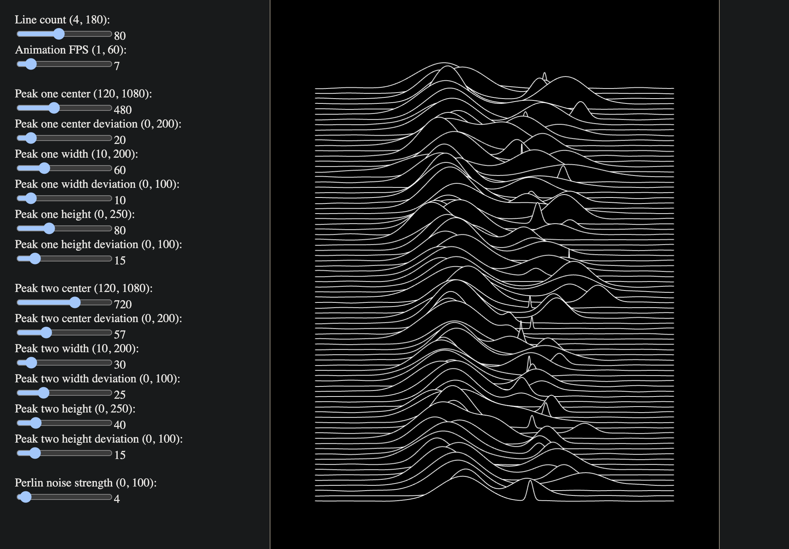

# Unknown Pleasures Cover Generator

An attempt to produce a generator for the Unknown Pleasures album cover art (Album by Joy Division, Artwork by Peter Saville, Original image from Pulsar CP 1919 in _The Cambridge Encyclopaedia of Astronomy_, Original plot created by Harold Craft). An image of the generator is provided below. The implementation uses two gaussian peaks with 1D perlin noise. 

A better implementation is [dvida's](https://github.com/dvida/UnknownPleasuresGenerator), which is very accurate and aesthetically pleasing. This will be copied and added. Another implementation that will be added is to have the lines representing frequency bins and accept microphone input and have it as an audio visualisation.

The link to the web page should be on the right hand side of the github UI.

Resources used to create this project:
